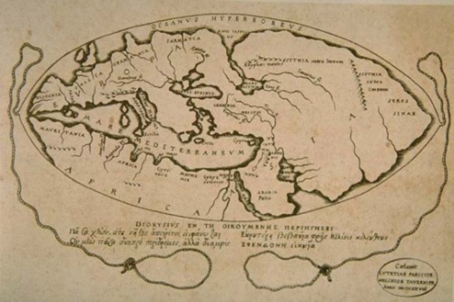

  
<!-- title -->

<!--lint ignore no-dead-urls-->
  
# **Awesome Historic(al) Maps** 
 

 <!-- subtitle -->
  
> *Historic(al) Maps: Meta guidance, tools, repositories, databases, search engines, and online resources for the exploration of Historic(al) Maps.*
  

  

Historic(al) is formatted in this way as "Historic Maps" implies maps that are fairly modern and analgous with the modern landscape. This repo encompasses both recent history and earlier.

To contribute to this list, please visit the [GitHub repository](https://github.com/stark1tty/Awesome-Historic_al-Maps).

<!-- TOC -->

# Contents

- [Databases and Search Engines](#Databases-and-Search-Engines)
  - [Search Engines](#Search-Engines)
  - [Databases](#Databases)
- [Map Collections](#Map-Collections)
  - [World](#World)
  - [Maritime](#Maritime)
  - [Military and Campaigns](#Military-and-Campaigns)
    - [US Civil War](#US-Civil-War)
    - [WW1](#WW1)
    - [WW2](#WW2)
  - [Africa](#Africa)
  - [Caribbean](#Caribbean)
  - [Europe](#Europe)
    - [Central Europe](#Western-Europe)
      - [Germany](#Germany)
      - [Switzerland](#Switzerland)
      - [The Netherlands](#The-Netherlands)
    - [Mediterranean](#Mediterranean)
    - [Northern Europe](#Northern-Europe)
      - [Norway](#Norway)
      - [Sweden](#Sweden)
    - [United Kingdom](#United-Kingdom)
      - [England](#England)
        - [Hampshire](#Hampshire)
        - [London](#London)
      - [Scotland](#Scotland)
      - [Wales](#Wales)
  - [North America](#North-America)
    - [United States](#United-States)
      - [Minnesota](#Minnesota)
      - [New York](#New-York)
- [Research Guides](#Research-Guides)
  - [General Research Guides](#General-Research-Guides)
  - [Guides by Topic](#Guides-by-Topic)
  - [Historical Maps in GIS](#Historical-Maps-in-GIS)
  - [Further Reading](#Further-Reading)
- [Tools](#Tools)
  - [Applications](#Applications)
  - [QGIS Extensions](#QGIS-Extensions)
  - [APIs](#APIs)
- [Dealers](#Dealers)
- [Other](#Other)
  - [Organisations](#Organisations)
  - [Links](#Links)
  - [Useful Awesome Lists](#Useful-Awesome-Lists)
    - [Digital Humanities](#digital-humanities)
    - [Geospatial](#geospatial)
- [Contribute](#Contribute)

---
---
<!-- CONTENT -->
| ▲ [Top](#Contents) |

## Databases and Search Engines

Meta historical mapping search engines and other geospatial data.

### Search Engines
- [Old Maps Online](https://www.oldmapsonline.org/) - OldMapsOnline search catalog that allows visitors to explore and discover the beauty of historical maps depicting a past geographical place of their interest.
- [National Library of Scotland's Map Finder](https://maps.nls.uk/geo/find/#zoom=7.0&lat=57.00000&lon=-4.40000&layers=102&b=1&z=0&point=0,0)

### Databases
- [Open Historical Map](https://www.openhistoricalmap.org/)
- [World Historical Gazetteer](https://whgazetteer.org/) - World Historical Gazetteer (WHG) is providing a collection of content and services that permit world historians, their students, and the general public to do spatial and temporal reasoning and visualization in a data rich environment at global and trans-regional scales.
- [Pleiades](https://pleiades.stoa.org/) - Pleiades is a community-built gazetteer and graph of ancient places. It publishes authoritative information about ancient places and spaces, providing unique services for finding, displaying, and reusing that information under open license. It publishes not just for individual human users, but also for search engines and for the widening array of computational research and visualization tools that support humanities teaching and research.

---
| ▲ [Top](#Contents) |

## Map Collections

### World
- [The Pelagios Network](https://pelagios.org/) - The Pelagios Network connects researchers, scientists and curators to link and explore the history of places. It is a long-running initiative that links information online through common references to places.
- [World Historical Atlas](http://x768.com/w/twha.en) - The World Historical Atlas is a world map which shows change of countries from the ancient time to the present time. [Patched version here.](https://github.com/kaorahi/patched-historical-atlas)
- [Historia Cartarum](https://historiacartarum.org/) - Website of Dr. John Wyatt Greenlee (Cornell University), providing resources, links and information about Medieval Maps.
- [American Geographical Society Library. 'Digital Map Collection'](https://uwm.edu/lib-collections/agsl-digital-map-collection/) - Maps ranging from early maps of Asia to historical maps of Wisconsin and Milwaukee, and other American cities, states, and national parks.
- [ChronoScope World](https://mprove.de/chronoscope/world.html) - Chronoscope World is a time machine to explore the history of the world by browsing maps dating back to 14th century B.C. More than 4,200 high-resolution maps can be displayed in a maps application on the correct geo location.
- [British Library Maps Collection](https://www.bl.uk/subjects/maps) - Includes:
  - [King George III Topographical and Maritime collections](https://www.bl.uk/collection-guides/king-george-iii): 30–40,000 maps, plans and views, both printed and hand-drawn, of all parts of the world
  - [Globes](https://www.bl.uk/collection-guides/globes): Terrestrial and celestial globes dating back to 1600 and gores dating to 1544.
  - [Digital mapping](https://www.bl.uk/collection-guides/digital-mapping): Geospatial data, cartographic applications, digital aerial photography and scanned-in historic map materials.
  - [Manuscript maps](https://www.bl.uk/collection-guides/manuscript-maps): Cartography from the Middle Ages to the present.
  - [Visual arts](https://www.bl.uk/subjects/visual-arts): Visual arts collections include paintings, drawings, prints and photographs.
- [National Library of Scotland Map Collection](https://maps.nls.uk/) - Extensive collection of maps from around the world including: Ordnance Survey maps, Maps of Scotland, County Maps, Estate Maps, Town Plans and views, Coastal/Admiralty charts, Military maps, Series maps, Bridges/Canals/Railways, Air Photo mosaics, Bathymetrical Survey, International/non-UK maps, and Atlases.
- [Wikimedia Commons: Category - Maps](https://commons.wikimedia.org/wiki/Category:Maps) - Wikimedia has an extensive collection of maps. Make sure to search here.
- [Archive.org - Images: Maps](https://archive.org/details/image?&and[]=subject%3A%22Map%22) - The Internet Archives has an extensive collection of maps. Make sure to search here.
- [The National Archives Map Collection (UK)](https://images.nationalarchives.gov.uk/assetbank-nationalarchives/action/browseItems?categoryId=23&categoryTypeId=1) - Maps and plans from 1485 to the early 1900s are covered in this collection, with a concentration around the 18th and 19th centuries. These include maps of America, Canada and the West Indies, plus military and political Foreign Office maps. There is also a collection of colourful maps of early England and Ireland.
- [University of Oxford: Bodleian Map Room](https://www.bodleian.ox.ac.uk/maps) - [Card Catalogue (Depreciated)](http://canvas1.bodleian.ox.ac.uk:5000/mmap/map-index.php)- The Bodleian holds nearly two million maps and around 20,000 atlases, including material dating from the 14th to the 21st century. The collection is international and includes maps from all over the world, although it is strongest in British material and maps from countries with a historical connection with the UK. There are early printed maps, town plans, manuscript estate maps, topographical series, scientific and geological mapping, sea charts, air charts and maps of the stars. These collections include:
  - [Digital Bodleian](https://digital.bodleian.ox.ac.uk/): Almost 2,500 maps and atlases are available on Digital Bodleian, with more to come soon.  
  - Portolan charts: Portolan charts are manuscript maps of coastal areas intended for maritime navigation. 
  - The Todhunter Allen Collection: The Todhunter Allen Collection of maps and county atlases dating from 1573 to 1900 acts as a microcosm of three centuries of British cartography. 
  - WWI trench maps: The Bodleian Libraries have approximately 2,500 maps of the Western Front, at scales of 1:10,000, 1:40,000, and 1:80,000. The GSGS published several editions of these maps throughout the war, although most are from late 1915 onwards.
  - Other map collections in the Bodleian: The Commonwealth and African Aerial Photograph Archive holds a part copy of the Ordnance Survey International Collection. This comprises approximately 1.5 million aerial photographs of countries in Eastern, Southern, and Western Africa, as well as parts of Asia and the Americas. These images were taken by the Directorate of Overseas Surveys (DOS) mainly in the 1940s-1970s, to enable them to produce maps at ground scales of 1:30,000 to 1:50,000. Enquiries about this collection should be directed to the [archivist](lucy.mccann@bodleian.ox.ac.uk). 
- [David Rumsey Map Collection](https://www.davidrumsey.com/) - The David Rumsey Map Collection was started over 35 years ago and contains more than 150,000 maps. The collection focuses on rare 16th through 21st century maps of North and South America, as well as maps of the World, Asia, Africa, Europe, and Oceania. The collection includes atlases, globes, wall maps, school geographies, pocket maps, books of exploration, maritime charts, and a variety of cartographic materials including pocket, wall, children's, and manuscript maps. Items range in date from around 1550 to the present.
- [r/oldmaps (Reddit)](https://www.reddit.com/r/oldmaps/) - User uploaded collection of interesting maps.
- [The Barry Lawrence Ruderman Collection](https://searchworks.stanford.edu/view/jw357py5564) - Collection of early maps, covering all parts of the world, sold by the dealer in La Jolla, California - mounted on the Stanford University Image Gallery.
- [Basel Mission Archives](http://www.bmarchives.org/) - Maps, sketches and plans relating to various parts of the world where the different Protestant missions operated.
- [Birmingham Library Map Collection](http://bplonline.cdmhost.com/digital/collection/p4017coll7/search) - 16th century onwards, and with general coverage; most of the maps from the Rucker Agee collection.
- [Cornell University Library Map Collection](http://www.sscommons.org/openlibrary/welcome.html) - Images from the Cornell University Library Map Collection.

| ▲ [Top](#Contents) |

### Maritime
- [Sea Atlases from the Harvard Map Collection](http://sea-atlases.org/) - Beginning in the late 16th century, the nascent cartographic publishing industry found a receptive market for pilot books and sea atlases, which provided collections of detailed charts and sailing directions for the most frequently traversed routes.
- [Nautical Maps - National Library of Wales](https://www.library.wales/discover-learn/digital-exhibitions/maps/nautical-maps)

| ▲ [Top](#Contents) |

### Military and Campaigns

#### US Civil War
- [Civil War Maps](https://www.loc.gov/collections/civil-war-maps)  
- [Civil War Treasures from the New-York Historical Society](https://cdm16694.contentdm.oclc.org/digital/collection/p16694coll47)

#### WW1
- [British First World War Trench Maps, 1915-1918 (NLS)](https://maps.nls.uk/ww1/trenches/) - Maps of the Western Front in the Great War depicting British and German trenches.
- [WW1 maps - National Library of Wales](https://www.library.wales/discover-learn/digital-exhibitions/maps/ww1-maps)

#### WW2
- [Narvik Bunkers](https://www.narvik-bunkers.no/overview/) - WW2 Fortifications and related structures in and around Narvik, Norway

| ▲ [Top](#Contents) |

### Africa
- [War Office Archive Maps (British Library)](https://www.bl.uk/collection-guides/war-office-archive): Military intelligence maps and associated documents relating to East Africa.

| ▲ [Top](#Contents) |

### Caribbean
- [Caribbean Views](https://www.bl.uk/onlinegallery/onlineex/carviews/index.html) - Over 1,200 images, maps and texts from the 18th and 19th centuries reveal contrasting experiences of life in the former British colonies.

| ▲ [Top](#Contents) |

### Europe
- [Mappa Mundi Explorer](https://www.themappamundi.co.uk/) - Scholars believe it was made around the year 1300 and shows the history, geography and destiny of humanity as it was understood in Christian Europe in the late thirteenth and early fourteenth centuries. [Short Documentary](https://aeon.co/videos/the-famed-medieval-map-that-stretched-beyond-earth-to-heaven-history-and-myth)
- [Denmark: Royal Library and Copenhagen University Library. 'Kort & Atlas'](http://www.kb.dk/maps/kortsa/2012/jul/kortatlas/en/) - Images from the Map & Atlas collection covering all parts of the world with a strong focus on northern Europe.

#### Central Europe
##### Germany
- [Landkartenarchiv]( https://www.landkartenarchiv.de/) - Archive of German mapping, different world atlases, national maps, topographical maps, road maps, panorama maps, railway maps, postal code maps, city maps and special maps; text in German and English.
- [Virtual Map Forum](https://kartenforum.slub-dresden.de/) - Collection of historical and georeferenced maps of the Saxon State and University Library Dresden (SLUB), with a focus on Central Germany and the period from 1700 to 1950.

##### Switzerland
- [Basel University Library](https://commons.m.wikimedia.org/wiki/Category:UB_Basel_Maps) - Maps of Switzerland and elsewhere, with a choice of resolution.

##### The Netherlands
- [Amsterdam University Library. 'Kaartencollectie'](http://dpc.uba.uva.nl/kaartencollectie/) covering The Netherlands and the rest of the world; offering groups of images with introductory text (in Dutch), including pages devoted to wall-maps (with the 1639 Colom map treated separately), the work of C. Claesz, water-feature mapping, the Atlas Van Schagen, the Goos 'Paskaart van Oost-Indi' (c.1658), etc.
- [Palaeogeographic maps of the Netherlands (Rijksdienst voor het Cultureel Erfgoed | Ministerie van Onderwijs, Cultuur en Wetenschap)](https://www.cultureelerfgoed.nl/onderwerpen/bronnen-en-kaarten/documenten/publicaties/2019/01/01/paleogeografische-kaarten-pdf)

#### Mediterranean
- [Ancient World Mapping Center (University of North Carolina at Chapel Hill)](http://awmc.unc.edu/wordpress/about/) - AWMC continues the work of the Classical Atlas Project that produced the landmark Barrington Atlas of the Greek and Roman World (R. J. A. Talbert ed., 2000). It continues to refine the geographic dataset (both cultural and physical) for the ancient Mediterranean world in partnership with Pleiades.

#### Northern Europe
##### Norway
- [Narvik Bunkers](https://www.narvik-bunkers.no/overview/) - WW2 Fortifications and related structures in and around Narvik, Norway

##### Sweden
- [TORA (Topographical Register at the National Archives) from The Swedish National Archives](https://riksarkivet.se/tora-english) - TORA consist of a geocoded register of historical settlement units in Sweden, and a linked open data service that connect historical sources and databases on the basis of geocoded settlements. [GitHub](https://github.com/Riksarkivet/tora)

| ▲ [Top](#Contents) |

#### United Kingdom
- [British History Online](https://www.british-history.ac.uk/catalogue/maps) - Historic maps of London from before 1800 and maps from the 19th-century series of the Ordnance Survey, including the complete 1:10,560 series and selected areas of the 1:2,500 maps. The Ordnance Survey maps can searched by keyword, title or postcode. Website also contains a plethora of digitised primary sources throughout Britsh history. 
- [Aerial Archaeology Mapping Explorer (Historic England)](https://historicengland.maps.arcgis.com/apps/webappviewer/index.html?id=d45dabecef5541f18255e12e5cd5f85a) - The ‘Aerial Archaeology Mapping Explorer’ map gives people access to a compilation of archaeological mapping data collected by Historic England, and its predecessor organisations, over a period of over 30 years. The archaeological mapping has been collected from a variety of modern and historic aerial photographic sources. [More info here.](https://historicengland.org.uk/research/results/aerial-archaeology-mapping-explorer/)
- [Digimap](https://digimap.edina.ac.uk/) (Requires UK University Log In) - Database viewer that includes a variety of Georeferenced Ordinance Survey Maps for the UK, as well as various modern basemaps, elevation and other data.
- [Ordnance Survey National Grid maps, 1944-1971 (National Library of Scotland)](https://maps.nls.uk/geo/records/#zoom=5&lat=56.0000&lon=-4.0000&layers=0&b=0&point=0,0) - The most detailed Ordnance Survey maps after the Second World War, including all scales of mapping - 1:1,250, 1:2,500 and 1:10,560 for Scotland and London, and just 1:10,560 scale mapping for all other parts of England and Wales. NLoS have just put online out-of-copyright maps, published over 50 years ago.
- [Matthew Paris’ Map of Britain (c. 1255 AD)](http://historiacartarum.org/annotated-claudius-map/) - An online, clickable interactive version of Matthew Paris' most famous map. Matthew Paris was a 13th-century Benedictine monk from St Albans in Hertfordshire who is renowned for his work as a historian, writer, artist, and cartographer. His maps of Britain were the most comprehensive of their time, featuring detailed depictions of the country's topography, including cathedrals, castles, ports, mountains, and rivers. Four of his maps still exist, with the most comprehensive being his *Abbreviatio compendiosa chronicorum Anglie* manuscript, which includes the walls of Hadrian and Antonine. [Click here](https://blogs.bl.uk/digitisedmanuscripts/2020/07/the-maps-of-matthew-paris.html) for more information from the British Library.
- [The Gough Map](https://goughmap.uk/map.php) - 14th C. map of Great Britian; The map is 115 cm x 56 cm in size on vellum, and consists of the coastline of the island of Great Britain, several smaller islands and parts of the coastlines of Ireland and the Continent. Rivers are depicted, and over 600 cities, towns and smaller settlements are represented by churches, fortifications or simple houses. Conventionally dated c. 1360 - c. 1370, it has been suggested on palaeographical grounds [Smallwood, 2010] that the map was made one or two decades after 1400. [More here.](https://www.ucl.ac.uk/early-medieval-atlas/map-data/routes-gough-map)
- [Ordnance Survey Mapping (British Library)](https://www.bl.uk/collection-guides/ordnance-survey-mapping): The most comprehensive, publicly accessible collection of Ordnance Survey maps in the world.

##### England
- [Key to English Place Names](http://kepn.nottingham.ac.uk/) - This is an up-to-date guide to the interpretation of the names of England's cities, towns and villages.
- [Goad fire insurance plans of the British Isles]( http://www.bl.uk/onlinegallery/onlineex/firemaps/fireinsurancemaps.html) - The British Library holds a comprehensive collection of fire insurance plans produced by the firm Charles E. Goad Ltd. dating back to 1885. These maps were made for most important towns and cities of the British Isles, and are invaluable sources of detailed information about urban areas and town centres.
- [The Unveiling of Britain, 800-1600](https://www.bl.uk/onlinegallery/onlineex/unvbrit/index.html) - This selection of maps and views traces the growing awareness of the form of British Isles and their place in the wider world from 800 to 1600.

###### Hampshire
- [Old Hampshire Mapped](https://www.oldhampshiremapped.org.uk/) - Comprehensive catalogue of Hampshire (UK) maps and related items, illustrated from the County Museums Service Collection, 2003.

###### London
- [Crace Collection of London plans](https://www.bl.uk/onlinegallery/onlineex/crace/) - Over 1200 maps and plans of the capital: a fascinating collection brought together by the Victorian designer, Frederick Crace.

##### Scotland
- [Charting the Nation](http://www.chartingthenation.lib.ed.ac.uk/) - The Charting the Nation image collection includes a wide variety of single maps and maps in atlases and other bound books, together with important manuscript and printed texts relating to the geography and mapping of Scotland from 1550 to 1740 and beyond.
- [Roy Military Survey of Scotland, 1747-55 (National Library of Scotland)](https://maps.nls.uk/geo/roy/#zoom=7&lat=56.8860&lon=-4.0709&layers=0) - The Roy Military Survey of Scotland, known to its contemporaries as the 'Great Map', is a uniquely important historical cartographic document. It provides a uniform graphic snapshot of the entire Scottish mainland at a time when the landscape was beginning an era of rapid change. For many Highland areas, it is the most detailed and informative map that survives for the entire 18th century, and for all areas, the only standard topographic map prior to the Ordnance Survey mapping in the 19th century.

##### Wales
- [National Library of Wales](https://www.library.wales/discover/digital-gallery/maps/)
  - [Maps of Wales - National Library of Wales](https://www.library.wales/discover-learn/digital-exhibitions/maps/maps-of-wales)
  - [County maps - National Library of Wales](https://www.library.wales/discover-learn/digital-exhibitions/maps/county-maps)
  - [Estate Maps - National Library of Wales](https://www.library.wales/discover-learn/digital-exhibitions/maps/estate-maps)
  - [Town Plans - National Library of Wales](https://www.library.wales/discover-learn/digital-exhibitions/maps/town-plans)
  - [Welsh Tithe Maps - National Library of Wales](https://www.library.wales/discover-learn/digital-exhibitions/maps/welsh-tithe-maps)
  - [Idris Mathias’ Manuscript Map of the Lower Teifi Valley - National Library of Wales](https://www.library.wales/discover-learn/digital-exhibitions/maps/idris-mathias-manuscript-map-of-the-lower-teifi-valley) - Browse Idris Mathias' beautiful manuscript map of the lower Teifi Valley.

| ▲ [Top](#Contents) |

### North America

#### United States
- [American Geographical Society Library. 'Digital Map Collection'](https://uwm.edu/lib-collections/agsl-digital-map-collection/) - Maps ranging from early maps of Asia to historical maps of Wisconsin and Milwaukee, and other American cities, states, and national parks.
- [New England Historic and Placename Directory](http://broermapsonline.org/site/placename-directory/) - Containing over 100,000 names. 

##### Minnesota
- [John R. Borchert Map Library, University of Minnesota]( https://www.lib.umn.edu/borchert) - With material on Minnesota, the USA and the rest of the world.

##### New York
- [The NYC Space/Time Directory](https://spacetime.nypl.org/) - The New York Public Library is creating a digital time-travel service for New York City with historical maps, collections rich in geospatial data, and the public’s help. It makes urban history accessible through a set of resources including: a searchable atlas of New York past, an historical location directory and geocoder, a set of APIs and data sets, and a discovery tool linking NYPL collections together in an historical and geographic context.

---
| ▲ [Top](#Contents) |

## Research Guides

### General Research Guides
- [A Guide to Reading Historic Maps (National Library of Scotland)](https://digital.nls.uk/mapping-history/learn-about-maps/step-by-step/)
- [How to Analyse Historic Maps Step-by-Step (National Library of Scotland)](https://digital.nls.uk/mapping-history/learn-about-maps/step-by-step/index.html)
- [Map Age Guide: A flowchart for figuring out the age of an undated world map.](https://xkcd.com/1688/) - A classic, useful flowchart by XKCD

### Guides by Topic
- [Cartographic Fakes, Forgeries and Facsimiles likely to deceive](http://www.maphistory.info/fakes.html) - A guide to identifying fake maps as well as a list of known forgeries. 
- [Guide to Figuring out the Age of an Undated World Map (xkcd)](https://xkcd.com/1688/)
- [Researching boundaries of parishes and counties (National Library of Scotland)](https://maps.nls.uk/geo/boundaries/history.html)
- [Researching climate change (National Library of Scotland)](https://maps.nls.uk/guides/climate/)
- [Researching house and building history (National Library of Scotland)](https://maps.nls.uk/guides/houses/)
- [Researching local history (National Library of Scotland)](https://maps.nls.uk/guides/local-history/)
- [Researching woodland history (National Library of Scotland)](https://maps.nls.uk/guides/woodland/)

### Historical Maps in GIS
- [Historical Maps in GIS by David Rumsey and Meredith Williams](http://www.davidrumsey.com/gis/ch01.pdf)
- Georeferencing
  - [Georeferencing in ArcGIS](https://storymaps.arcgis.com/stories/dd75d0398f7d4ded924d303161895b8b)
  - [Video: Georeferencing Tutorial for a Graduate Digital Humanities Course by Ryan Cordell](https://www.youtube.com/watch?v=jy9igyZbLjs&ab_channel=RyanCordell) - Using ArcGIS (YouTube)
  - [Digitising Map Data in QGIS](https://www.qgistutorials.com/en/docs/digitizing_basics.html)
  - [Georeferencing in QGIS](https://www.youtube.com/watch?v=g-4jFTR2EC0) (YouTube)
- [Using LiDAR layers for landscape research (National Library of Scotland)](https://maps.nls.uk/guides/lidar/)
- [Re-using georeferenced maps - within GIS and other software (National Library of Scotland)](https://maps.nls.uk/guides/georeferencing/)
- [Re-using map datasets - within GIS and other software (National Library of Scotland)](https://maps.nls.uk/guides/datasets/)

### Further Reading
- [Map History/History of Cartography](http://www.maphistory.info/index.html) - A long running, general information site with information about old maps, both on the web and in the real world.

---
| ▲ [Top](#Contents) |

## Tools

### Applications
- [QGIS](https://www.qgis.org/en/site/) - A free, open-source desktop GIS used for creating, editing, visualising, analysing and publishing geospatial information. It is part of the OSGeo project and can be used in conjunction with other open-source geospatial products.
  - [Training material on the QGIS website](https://docs.qgis.org/3.4/en/docs/gentle_gis_introduction/index.html)
  - [further tutorials online](http://www.qgistutorials.com/en/)
  - [LinkedIn Learning: QGIS Tutorials and Tips](https://www.linkedin.com/learning/learning-qgis-2015/welcome?u=76177458)
- [ArcGIS Online](https://www.arcgis.com/) - ArcGIS Online is a completely web-based GIS useful for viewing, sharing and editing data. There is an increasing amount of published open GIS data that can be added quickly into the online map platform and some spatial analysis can be run on the fly. Requires an ArcGIS Online account, available as a University account or free personal account with limited credits. 
  - [Tutorial](https://learn.arcgis.com/en/projects/get-started-with-arcgis-online/)
- [MapAnalyst](https://mapanalyst.org/) - MapAnalyst is a software application for the accuracy analysis of old maps. Its main purpose is to compute distortion grids and other types of visualizations that illustrate the geometrical accuracy and distortion of old maps. [More about this tool here.](https://www.researchgate.net/publication/220144108_Visualizing_the_Planimetric_Accuracy_Of_Historical_Maps_With_MapAnalyst)
- [Map Warper](https://github.com/timwaters/mapwarper) - Mapwarper is an open source map geo-rectification, warping and georeferencing application. It enables a user to upload an image, a scanned map or aerial photo for example, and by placing control points on a reference map and the image, to warp it, to stretch it to fit.
- [Georeferencer: Crowdsourced Georeferencing for Map Library Collections](http://www.dlib.org/dlib/november12/fleet/11fleet.html)
- [HiRoNEx: Historical Road Network Extractor](https://github.com/johannesuhl/hironex) - A python tool for automatic, fully unsupervised extraction of historical road networks from historical maps.
- [MapReader](https://github.com/Living-with-machines/MapReader) - MapReader is an end-to-end computer vision (CV) pipeline for exploring and analyzing images at scale. MapReader was developed in the Living with Machines project to analyze large collections of historical maps but is a generalisable computer vision pipeline which can be applied to any images in a wide variety of domains.
- [desCartes](https://github.com/docuracy/desCartes) - desCartes recognises roads on old maps, and converts them to vector lines that can be used in GIS applications and historical transport network analysis.
- [Allmaps](https://allmaps.org/) - Curating, georeferencing and exploring for IIIF maps. 100,000s of maps are available through IIIF, across libraries, archives and museums worldwide. Allmaps makes it easier and more inspiring to explore, georeference and work with collections of digitized maps.

### QGIS Extensions
- [Historical Maps Vectorization Tools](https://github.com/EVS-GIS/hmvt-cli) - A toolbox to vectorize fluvial corridor objects on historical maps. 

### APIs
- [Historic Maps API layers: georeferenced map layers of Great Britain and Ireland for re-use (National Library of Scotland)](https://maps.nls.uk/projects/api/)

---
| ▲ [Top](#Contents) |

### Dealers
- [EBay](https://www.ebay.co.uk/b/Antique-Maps-Atlases-Globes/37958/bn_1838635)

---
| ▲ [Top](#Contents) |

## Other 
### Organisations
- [International Map Collector's Society](https://www.imcos.org/) - IMCoS is a Society of people of all ages who love antique and vintage maps. We are a group of collectors, dealers, librarians, academics and just plain enthusiasts who share their common interest through meeting each other and exchanging information through a quarterly Journal. We live in many different countries and the society has organised events in all five continents through its network of international representatives. The Society supports the study of cartographic history by contributing to lecture programmes and research projects. IMCoS has its share of experts but the great majority of us belong because we like maps, want to learn more about them and enjoy talking to enthusiasts with a similar interest.

### Links
- [mapschool](https://mapschool.io/) - A free introduction to geo, "not a textbook."; A useful introduction to general geospatial terms, techniques and more.
- [Cartography Portal on Wikipedia](https://en.wikipedia.org/wiki/Category:Cartography)

### Useful Awesome Lists
#### Digital Humanities
- [awesome digital humanities](https://github.com/dh-tech/awesome-digital-humanities) - Software for humanities scholars using quantitative or computational methods.

#### Geospatial
- [awesome GIS](https://github.com/sshuair/awesome-gis) - Awesome list related to all things Geographic Information Systems (GIS).
- [awesome-qgis](https://github.com/totpero/awesome-qgis) - Awesome list related to all things QGIS, the FOSS GIS program.
- [awesome-arcgis](https://github.com/esri-es/awesome-arcgis/) - Resource list/Wiki for ArcGIS users and developers.
- [awesome-earthobservation-code](https://github.com/acgeospatial/awesome-earthobservation-code) - Curated list of awesome tools, tutorials, code, helpful projects, links, stuff about Earth Observation and Geospatial stuff!
- [Awesome-GEE](https://github.com/giswqs/Awesome-GEE) - A curated list of Google Earth Engine resources.
- [awesome-geojson](https://github.com/tmcw/awesome-geojson) - GeoJSON utilities that will make your life easier.
- [Awesome GeoSpatial](https://github.com/sacridini/Awesome-Geospatial) - Long list of geospatial tools and resources.
- [awesome-geospatial-companies](https://github.com/chrieke/awesome-geospatial-companies) - List of 500+ geospatial companies (GIS, Earth Observation, UAV, Satellite, Digital Farming, ...)
- [awesome-open-geoscience](https://github.com/softwareunderground/awesome-open-geoscience) - Curated from repositories that make our lives as geoscientists, hackers and data wranglers easier or just more awesome.
- [awesome-remote-sensing-change-detection](https://github.com/wenhwu/awesome-remote-sensing-change-detection) - List of datasets, codes, researchers and contests related to remote sensing change detection.
- [awesome-satellite-imagery-datasets](https://github.com/chrieke/awesome-satellite-imagery-datasets) - List of satellite imagery datasets with annotations for computer vision and deep learning.
- [awesome-vector-tiles](https://github.com/mapbox/awesome-vector-tiles) - Awesome implementations of the Mapbox Vector Tile specification.
<!-- END CONTENT -->
---
---
| ▲ [Top](#Contents) |

## Contribute

Contributions welcome! Read the [contribution guidelines](contributing.md) first.

[Thanks goes to these contributors](https://github.com/stark1tty/awesome-Historic_al-Maps/graphs/contributors)!
